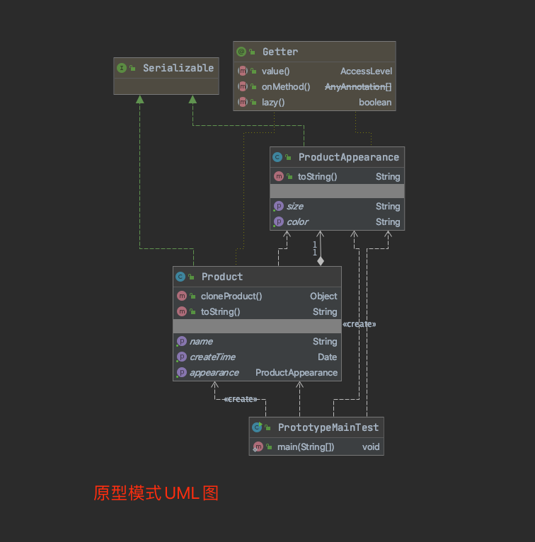
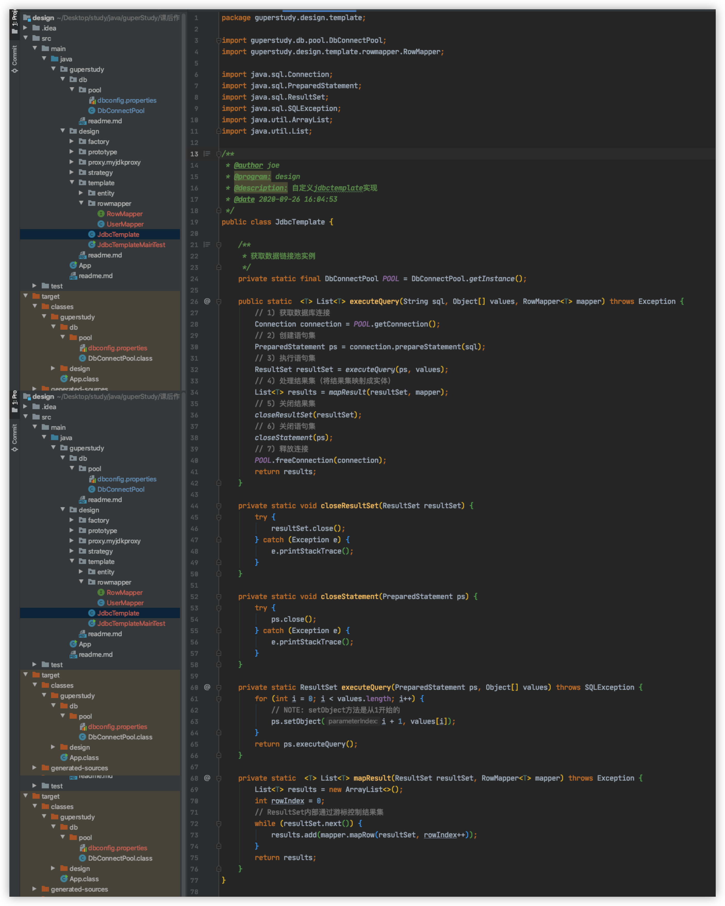

## 第一周第一次作业
1、总结每种单例写法的优缺点
单例模式可以分为饿汉式和懒汉式
饿汉式的优缺点：
  优点：无需加锁，执行效率更高。一般在在应用启动时就执行单例初始化，可以及早暴露初始化中存在的问题
  缺点：类加载时单例就初始化，如果不使用的话，等于无谓的占用内存空间
懒汉式优缺点：
  优点：只有用到单例时，才产生单例，不会浪费内存空间
  缺点：为了保证创建单例对象的线程安全，创建代码相对复杂。若初始化单例过程存在问题，无法及早暴露，往往在应用运行过程中才暴露问题

2、思考破坏单例模式的方式有哪些？并且归纳总结
破坏单例的方式：反射破坏、序列化破坏、
反射破坏原理：通过反射获取到单例类原本私有的构造函数，然后通过强制访问此私有构造函数来创建另一个类实例。
反射破坏解决办法：在私有构造函数的基础上对当前是否已经存在单例对象进行判断，如果存在则抛出异常，阻止第二个实例的初始化
序列化破坏原理：单例类如果实现了序列化接口，会被通过序列化成字节再反序列成对象的方式，来创建出第二个类实例。
序列化破坏解决办法1：在单例类中重写readResolve方法，返回同样的单例对象即可。缺点：每次从字节反序列时，实际都创建了一个新的对象，只是创建后被废弃了，这样无谓的创建新对象会造成无谓的开销。可以使用注册式的单例模式来解决这个问题
序列化破坏解决办法2：注册式单例，注册式单例又分为两种枚举类单例和容器缓存式。
  枚举类单例：利用枚举类来实现单例，由于枚举类不能被类加载器加载多次，并且枚举类单例实际上利用了静态代码块来初始化实例（饿汉式）。因此保证了枚举类实例的初始化只有一次，所以即使被序列化和反序列化也不会创建新的单例，避免了内存浪费。此外由于JDK限制了无法使用反射类实例化枚举类，因此使用反射的方式也无法破坏枚举类单例。
  容器缓存式单例：利用一个map容器存储单例对象，每次获取单例对象都从map容器中取出，若map容器中没有则新建单例对象并存入容器。

3、梳理内部类的执行逻辑，并画出时序图
  以课程中的内部类懒汉式单例模式代码为例进行分析：
  应用启动 -> 调用外部类静态方法（LazyInnerClassGeneral.getInstance()） -> 触发外部类初始化：初始化外部类的静态成员，执行外部类静态代码块 -> 访问到内部类的LAZY静态成员（LazyHolder.LAZY） -> 触发内部类初始化：初始化内部类的静态成员，执行内部类静态代码块 -> 初始化单例

## 第一周第二次作业
1、用UML绘制出三种工厂模式的类结构图
简单工厂UML

工厂方法UML

抽象工厂UML

2、深刻理解产品族和产品等级结构之间的关系
产品簇和产品等级结构是划分产品的两种不同维度。
产品簇是指同一工厂中生产出来的系列产品
产品等级可以理解为不同工厂中生产出来的同类型的产品

3、自主完成三种工厂模式的代码实现，理解简单工厂、工厂方法和抽象工厂的区别
工厂模式的本质是为了隐藏创建对象的复杂过程，让用户方便的获取想要的目标对象。
简单工厂是工厂模式的简单应用，通过一个工厂对象来接收用户的入参，封装创建过程，得到用户想要的目标对象。简单工厂的缺点是工厂的职责过重（因为一个工厂类负责生产所有对象），不易于拓展过于复杂的产品。
工厂方法是简单工厂的基础上，对工厂进行接口抽象与分类。首先定义一个工厂抽象接口，然后通过区分工厂职责来将简单工厂中的万能工厂拆分成多个不同的工厂子类，不同的工厂子类专注于创建属于自己的目标对象（工厂方法让类的实例化推迟到子类中进行）。工厂方式的优点在于符合开闭原则，易于拓展。缺点是工厂类的个数容易过多，增加复杂度。
抽象工厂是在工厂方法的基础上，面对产品簇的形式时，让一个工厂能创建出对应产品簇中的一系列产品。抽象工厂的缺点是：新增产品簇中的产品时，往往需要修改到抽象工厂的接口，进而导致需要修改工厂子类，不符合开闭原则

## 第二周第一次作业
1、运用原型模式重构一段代码
原型模式的本质是当创建一个对象非常繁琐时，可以使用一个已创建好的对象作为原型，通过“克隆”的方式以原型对象为样本，批量生成同类对象。而其中具体“克隆”的实现方式可以用户自由实现，但通常会向外界隐藏这一过程。
实现“克隆”的时候需求重点根据自己的需求来区分是“浅克隆” or “深克隆”。
浅克隆：浅克隆仅仅是对原型对象自身的克隆，对于原型对象所引用的其他对象并不会进行克隆。浅克隆的好处是效率高且节省内存；坏处是克隆出的对象与原型对象引用的对像本质上是同一个对象，一旦被修改会影响到原型对象以及所有克隆出的对象
深克隆：深克隆是不仅克隆原型对象本身，还对原型对象所引用的其他对象进行了递归式的克隆。深克隆的优缺点基本与浅克隆相反，效率低、更占内存；但是克隆出的对象与原型对象之间互不影响。

原型模式重构代码，详见附件图片1、2.

2、仿JDK动态代理实现原理，自己手写一遍
JDK动态代理的原理：利用JDK提供的proxy包为被代理对象动态创建出代理对象，此代理对象会重写被代理对象的所有实现接口，在重写的接口方法中，先调用before拦截方法（此方法可以由用户自行实现）、再调用被代理对象的原接口方法、后调用after拦截方法（此方法可以由用户自行实现），以此实现对被代理对象的访问控制和方法增强。
与静态代理相比，动态代理优缺点如下：
缺点：动态代理效率相对较低，具体体现在动态代理要么依赖于反射来实现代理（JDK动态代理实现，此时依赖反射效率降低）要么通过动态生成fastclass来实现代理避免反射（CGLib动态代理，此时需要生成更多的class，更消耗内存）
优点：动态代理让代理类和被代理类实现了解耦，在更换被代理类或者被代理类需要改造时，无需变更代理类，这样更加符合开闭原则。
动态代理在spring上面的应用：实际上spring上的AOP就使用动态代理实现，既包含了JDK动态代理（JdkDynamicAopProxy类 JdkDynamicAopProxy 类 ）也包含了CGLib（CglibAopProxy 类）动态代理，代理的选择原则如下：
1、如果Spring的配置文件指定了代理的实现方式，则使用指定的实现方式
2、若bean实现了接口，则使用JDK动态代理
3、若bean未实现接口，则使用CGLib动态代理。

仿JDK动态代理的代理，详见附件图片3.

## 第二周第二次作业
1、举例Spring源码中你见过的委派模式，并画出类关系图
spring中实现委派模式的典型场景如下：
1、DispatcherServlet：通过委派模式，将http请求委派给不同的controller进行处理。
2、在Spring源码中，只要以Delegate结尾的 都是实现了委派模式：例如BeanDefinitionParserDelegate 根据不同类型委派不同的 逻辑解析 BeanDefinition。 

其中DispatcherServlet的类关系图详见附件图片4

2、利用策略模式重构一段代码
策略模式是指定义了一系列的算法，形成一个算法家族，外部用户通过入参等方式，来调用算法家族中不同的算法。算法之间可以相互切换互不影响。
为了避免实现策略模式时出现众多的if else或者switch等条件判断代码，策略模式还通常与Map相结合，利用常量定义每个策略的名称作为key，策略对象作为value，将众多策略对象存储在容器map中。在运行时，通过策略名称从容器map中取出对应的策略对象进行执行。

重构代码详见附件：附件图片5

## 第三周第一次作业
1、思考：模板模式除了继承以外，还有哪些实现方式？
模板模式本质上将一个算法中不变的过程封装起来，可变的过程暴露出去给用户实现。要实现这个可变的过程可以有多种方式，最常见的有以下两种方式：
a、子类实现：将不变的部分抽取到父类，由父类提供算法流程和算法不变部分的封装，将可变的部分留给子类实现。
b、外部接口类实现：由一个算法主体类将算法的流程和不变的部分封装起来，将可变的部分抽象成执行接口对外暴露，由用户实现执行接口并且传入实例到算法主体类的算法流程中进行运行。
以教程中的JdbcTemplate为例子，一次数据库操作的主要流程是：
1) 获取数据库连接
2) 创建语句集
3) 执行语句集
4) 处理结果集（将结果集映射成实体）
5) 关闭结果集
6) 关闭语句集
7) 关闭连接
这个操作流程基本固定并且其中步骤1、3、5、6、7也是固定的，这些都可以封装在算法主体类（JdbcTemplate）中。而步骤2、4为可变步骤，步骤2需要用户提供自定义sql语句，此步骤可以通过用户传入字符串参数解决，步骤4则需要用户自定义结果集映射实体的过程，此步骤可以抽象成执行接口RowMapper由用户实现，并且通过传入相关实例的方式在算法流程中进行运行。
JdbcTemplate的实现代码详见github仓库：https://github.com/aasailan/guperStudy/tree/master/%E4%BB%A3%E7%A0%81%E7%BB%83%E4%B9%A0/design/src/main/java/guperstudy/design/template
附件为JdbcTemplate的实现截图和UML类图

## 第三周第二次作业
1、使用适配模式，重构一段需要升级功能且兼容老系统的业务代码
适配模式的本质是将一个类的接口转换成客户期望的另一个接口，使原本接口不相容的接口可以一起工作，属于结构型设计模式。
以教程中的登录业务为例，原本存在着一个用户名密码登录方式，但是随着业务发展，需要实现其他的第三方登录。对于第三方登录来说，只有第三方授权的部分是可变的，登录后初始化用户会话等等步骤与原来的用户名密码登录方式并无两样。所以此时需要实现一个第三方授权登录的适配器，对外改变登录接口的暴露方式，且同时兼容原来用户名密码的登录方式。
实现代码详见github仓库：https://github.com/aasailan/guperStudy/tree/master/%E4%BB%A3%E7%A0%81%E7%BB%83%E4%B9%A0/design/src/main/java/guperstudy/design/adapter
附件为适配器模式实现的UML类图

## 第四周第一次作业
1、思考并总结装饰者模式和适配器模式的根本区别
装饰器模式和适配器模式都是包装模式，其中装饰器模式是一种特殊的代理模式。区分设计模式的关键在于目的而不在于结构，结构是为了实现目的制造出来的。装饰器模式和适配器模式的根本区别在于目的不同：装饰器模式的目的是利用装饰器在不改变原对象的基础上进行功能拓展；适配器模式的目的是利用适配器在不改变原对象的基础上对接口进行转换。在实现手段上，两种设计模式都利用了静态代理的方式来实现，因此两种设计模式从结构上来看会与静态代理比较类似。但是实现目的不同导致两种设计模式在以下五个方面会有细节上的差别：
形式上：装饰器模式属于一种特殊的代理模式，具有明显的层级关系；适配器模式没有层级关系
定义上：装饰者和被装饰者都实现同一个接口，主要目的是为了扩展之后依旧保留OOP关系；适配器和被适配者没有必然的联系，通常是采用继承或代理的形式进行包装
关系上：装饰器满足is-a关系；适配器满足has-a的关系
功能上：装饰器注重覆盖、拓展；适配器注重兼容、转换
设计上：装饰器通常需要前置考虑，在编写之前就将类的关系设计好；适配器通常是后置考虑，有点亡羊补牢的意味。

TODO: 问题：为什么装饰者和被装饰者需要保留OOP关系？（装饰者需要继承被装饰者）

2、用Guava API实现GPer社区提问通知的业务场景
Guava是google提供的用于实现观察者模型的库。其实现观察者模型的关键在于使用EventBus充当被观测者（事件发布者），使用@Subscribe注解将某个方法标记为事件回调方法。
使用Guava API实现GPer社区提问通知的业务场景的代码详见：https://github.com/aasailan/guperStudy/tree/master/%E4%BB%A3%E7%A0%81%E7%BB%83%E4%B9%A0/design/src/main/java/guperstudy/design/observer/guava
附件为三个类的截图

## 第四周第二次作业
1、用一句自己的话总结学过的设计模式（要精准）
以下是对所学的设计模式的总结：(详见附件1的表格)
|设计模式|所属类型|目的与本质|一句话总结|
|-|-|-|-|
|工厂方法|创建型|封装创建对象的复杂过程；使用接口统一工厂的创建方法，再定义不同的工厂子类来创建不同的对象，实现工厂的专一原则|隐藏创建过程，工厂产品一对一生产
|抽象工厂|创建型|封装创建对象的复杂过程；使用接口定义工厂的一系列创建方法（面向产品簇），再通过工厂子类实现不同类型产品簇的生产|隐藏创建过程，工厂面向产品簇进行生产|
|单例模式|结构型|保证一个类在任何情况下都只有一个实例，并提供一个全局的访问点|保证独一无二|
|原型模式|创建型|以一个对象为原型模板，通过克隆的方式快速生成对象|一根猴毛，吹出千万个|
|代理模式|结构型|使用一个代理对象来控制被代理对象的访问，以实现功能增强的目的|找人办事，增强职责。|
|委派模式| -- |一个类负责对外接收任务，但将任务委派给其他类进行实现，结构上通常使用静态代理实现|算你的（普通员工），功 劳算我的（项目经理）|
|策略模式|行为型| 策略模式使用一系列的算法家族，在不同情况下调用不同的策略算法，算法之间可以相互替换|用户选择，结果统一|
|模板模式|结构型|模板模式本质上将一个算法中不变的过程封装起来，可变的过程暴露出去给用户实现|程标准化，自己实现定制|
|适配器模式|结构型|适配模式的本质是将一个类的接口转换成客户期望的另一个接口，使原本接口不相容的接口可以一起工作，结构上通常使用静态代理来控制被适配对象的访问|兼容转换头|
|装饰器模式|行为型|在不改变原对象的基础上，通过装饰器实现对被装饰对象的功能增强。在结构上通常使用静态代理来实现装饰器对被装饰对象的引用控制|包装，同宗同源|
|观察者模式|行为型|将观察者注册到被观察者身上，被观察者通过发布事件来触发观察者进行回调|任务完成时通知。|

2、列举SpringAOP、IOC、DI应用的代码片段
SpringAOP：面向切面编程就是指找出多个bean中有一定规律的代码，开发时将其拆开，运行时将其合并。spring中的AOP代理通常有两种实现方式JDK动态代理和CGLIB动态代理，其中JDK动态代理基于接口、CGLIB动态代理基于继承。日常开发中spring的interceptor（拦截器）就是典型的面向切面编程。除此之外比如调试信息输出；统一错误处理；日志监控；事务开启关闭；权限控制等等都可以使用AOP的思想。附件2是在拦截器中针对登录权限进行判断的截图

IOC：控制反转，将创建对象的控制权反转给spring，spring通过BeanFactory来创建bean对象，用户只需要获取即可。日常开发中，比如通过xml文件定义bean，或者通过注解 等方式来定义Bean等等都属于IOC的应用范畴。附件3是使用注解定义Controller的截图

DI/DL：DI（依赖注入）或者DL（依赖查找），Spring在IOC容器的基础上，不仅保存自己创建的对象，而且保存对象与对象之间的关系。使用注入的方式进行赋值。日常开发中，使用@Autowried、@Resource或者xml定义constructor等等方式都属于DI的体现。附件4是使用@Autowried注解进行依赖注入得到bean实例的截图

## 第五周第一次作业
1、使用Processon绘制Spring系统架构图
spring官方对于Spring5 runtime的架构解释参考网页：https://docs.spring.io/spring-framework/docs/5.0.0.RC2/spring-framework-reference/overview.html
Spring的系统架构可以分为7大部分：Core Container（核心容器）、AOP（面向切面编程）、instrment（设备支持）、Data Access/Integration（数据访问和集成）、Web、Messaging（报文发送）、Test（Spring测试模块）。每一个部分的功能以及包括的模块如下：
* Core Container（核心容器）：核心容器包含了spring-beans、spring-core、spring-context、spring-expression四个部分。
  * Beans与Core是Spring的核心模块：包含了控制反转（Inversion of Control, IOC）和依赖注入（Dependency Injection, DI）。其中包含了BeanFactory接口，此接口是Spring框架中的核心接口，其子类实现了创建Bean、与依赖关系装配等功能。
  * Context模块：此模块拓展了BeanFactory接口，增加了Bean生命周期控制，框架事件体系以及资源加载透明化等功能。其中ApplicationContext是此模块的核心接口，它的超类是BeanFactory。与BeanFactory 不同，ApplicationContext 容器实例化后会自动对所有的单实例 Bean 进行实例化与依 赖关系的装配，使之处于待用状态。除此之外Context还包括了一些子模块：
  spring-context-support 模块是对 Spring IOC 容器的扩展支持，以及 IOC 子容器。 spring-context-indexer 模块是 Spring 的类管理组件和 Classpath 扫描。 
* AOP（面向切面编程）：AOP部分主要包含了两个模块spring-aop和spring-aspects。
  * spring-aop是spring的核心模块，是AOP的主要实现。以JVM的动态代理和CGLib动态代理技术实现。
  * spring-aspects是spring集成了aspectJ框架，主要为Spring AOP提供多种AOP实现方式
* instrment（设备支持)：主要包含了spring-instrment模块
  * spring-instrment：spring-instrument 模块是基于 JAVA SE 中的"java.lang.instrument"进行设计的，应该算是 AOP 的一个支援模块，主要作用是在 JVM 启用时，生成一个代理类，程序员通过代理类在运行时修改类的 字节， 从而改变一个类的功能， 实现 AOP 的功能。
* Data Access/Integration（数据访问和集成）：由 spring-jdbc、spring-tx、spring-orm、spring-jms 和 spring-oxm 5 个模块组成。 
  * spring-jdbc：此模块是 Spring 提供的 JDBC 抽象框架的主要实现模块， 用于简化 Spring JDBC 操作 。 主要是提供 JDBC 模板方式、关系数据库对象化方式、SimpleJdbc 方式、事务管理来简化 JDBC 编程， 主要实现类是 JdbcTemplate、SimpleJdbcTemplate 以及 NamedParameterJdbcTemplate。 
  * spring-tx 模块是 Spring JDBC 事务控制实现模块。使用 Spring 框架，它对事务做了很好的封装， 通过它的 AOP 配置，可以灵活的配置在任何一层。
  * spring-orm 模块是 ORM 框架支持模块，主要集成 Hibernate, Java Persistence API (JPA) 和 Java Data Objects (JDO) 用于资源管理、数据访问对象(DAO)的实现和事务策略。
  * spring-oxm 模块主要提供一个抽象层以支撑 OXM（OXM 是 Object-to-XML-Mapping 的缩写， 它是一个 O/M-mapper，将 java 对象映射成 XML 数据，或者将 XML 数据映射成 java 对象），例如： JAXB, Castor, XMLBeans, JiBX 和 XStream 等。 
  * spring-jms 模块（Java Messaging Service）能够发送和接收信息，为spring-messaging模块提供支撑
* Web：由 spring-web、spring-webmvc、spring-websocket 和 spring-webflux 4 个模块组成，为spring提供构建web应用的能力
  * spring-web 模块为 Spring 提供了最基础 Web 支持，主要建立于核心容器之上，通过 Servlet 或 者 Listeners 来初始化 IOC 容器，也包含一些与 Web 相关的支持。
  * spring-webmvc 传统的 Web-Servlet 模块，实现了 Spring MVC （model-view-Controller）的 Web 应用。 
  * spring-websocket 模块主要是与 Web 前端的全双工通讯的协议。
  * spring-webflux 是一个新的非堵塞函数式 Reactive Web 框架，可以用来建立异步的，非阻塞， 事件驱动的服务，并且扩展性非常好。 
* Messaging（报文发送）:主要包含 spring-messaging 模块，是从 Spring4 开始新加入的一个模块，主要职责是为 Spring 框架集 成一些基础的报文传送应用。
* Test（Spring测试模块）：为spring提供集成测试功能
以下是spring官方给出的spring5 runtime系统架构图（见附件1）

以下是自己根据视频教程使用process-on画出的系统架构图（见附件2）

2、理解SpringIOC容器的核心作用，生成类关系图
SpringIOC的容器是Spring能实现BOP（面向Bean编程）的关键。通过IOC容器，使得用户只需要通过配置文件或者注解这种声明式的方式来描述bean如何生成以及专注于使用bean实例来完成业务功能编写，复杂繁琐的bean对象创建和bean对象之间的复杂依赖都由IOC容器完成和管理。由于spring的DI、AOP等核心功能都是基于IOC容器实现，因此IOC容器是spring的基石。
在构建完spring的源码后，可以生成ApplicationContext的类关系图，见附件3

## 第五周第二次作业
1、理解SpringIOC、DI、MVC的基本执行原理
SpringIOC容器的初始化的简要描述：扫描指定包路径底下的class，检测这些class是否存在bean相关注解（比如@Controller、@Service等等）。对于存在目标注解的class创建出bean实例。以beanName或者bean实例的class类型为key，bean实例为value，存入SpringIOC。
DI的简要描述：在springIOC初始化以后，对bean实例的field进行扫描，找到拥有注入相关注解（比如@Autowired）的field，以注解定义的beanName或者field的类型为key，在IOC容器中获取对应的bean实例，通过反射将此bean实例设置到field上，完成DI
MVC的简要描述：定义DispatcherServlet继承HttpServlet，重写init方法、doPost等关键方法。在init方法中通过反射等方式解析GPRequestMapping等注解，完成url对指定处理方法的映射（初始化handlerMappings）。在doPost等方法中调用自定义的doDisPatch方法，在doDisPatch方法中，通过当前请求的url，检索到对应的处理方法并通过反射调用，得到处理结果，最后将处理结果写入response中完成当前请求的处理。

2、自己手写一个Mini版本的SpringMVC
详细代码可参见：
附件4 是自己手写的GPDispatcherServlet的截图。

