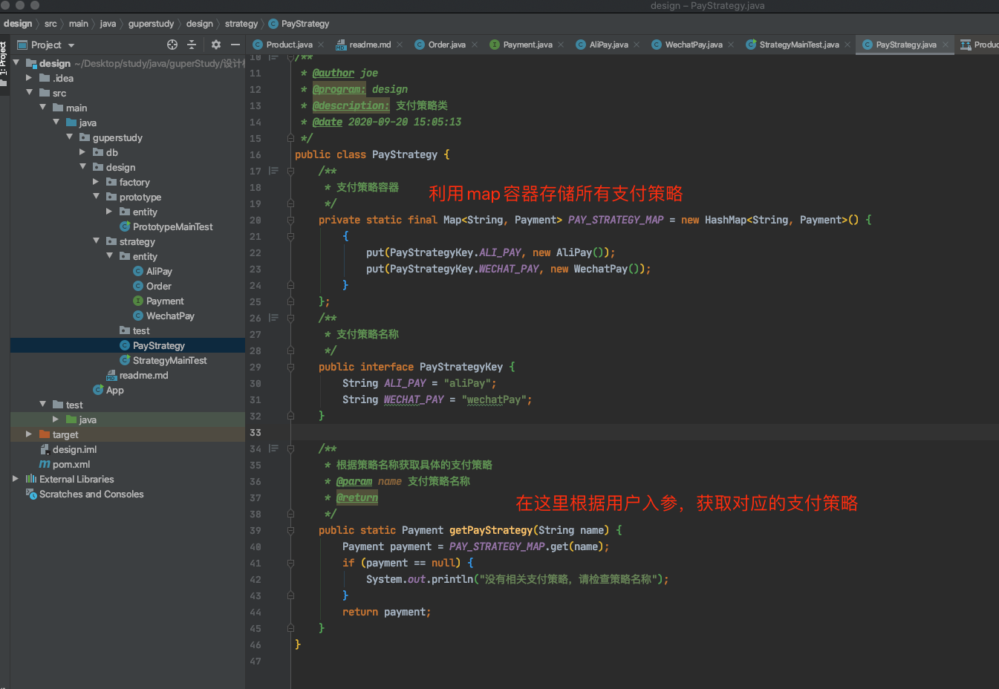

## 第一周第一次作业
1、总结每种单例写法的优缺点
单例模式可以分为饿汉式和懒汉式
饿汉式的优缺点：
  优点：无需加锁，执行效率更高。一般在在应用启动时就执行单例初始化，可以及早暴露初始化中存在的问题
  缺点：类加载时单例就初始化，如果不使用的话，等于无谓的占用内存空间
懒汉式优缺点：
  优点：只有用到单例时，才产生单例，不会浪费内存空间
  缺点：为了保证创建单例对象的线程安全，创建代码相对复杂。若初始化单例过程存在问题，无法及早暴露，往往在应用运行过程中才暴露问题

2、思考破坏单例模式的方式有哪些？并且归纳总结
破坏单例的方式：反射破坏、序列化破坏、
反射破坏原理：通过反射获取到单例类原本私有的构造函数，然后通过强制访问此私有构造函数来创建另一个类实例。
反射破坏解决办法：在私有构造函数的基础上对当前是否已经存在单例对象进行判断，如果存在则抛出异常，阻止第二个实例的初始化
序列化破坏原理：单例类如果实现了序列化接口，会被通过序列化成字节再反序列成对象的方式，来创建出第二个类实例。
序列化破坏解决办法1：在单例类中重写readResolve方法，返回同样的单例对象即可。缺点：每次从字节反序列时，实际都创建了一个新的对象，只是创建后被废弃了，这样无谓的创建新对象会造成无谓的开销。可以使用注册式的单例模式来解决这个问题
序列化破坏解决办法2：注册式单例，注册式单例又分为两种枚举类单例和容器缓存式。
  枚举类单例：利用枚举类来实现单例，由于枚举类不能被类加载器加载多次，并且枚举类单例实际上利用了静态代码块来初始化实例（饿汉式）。因此保证了枚举类实例的初始化只有一次，所以即使被序列化和反序列化也不会创建新的单例，避免了内存浪费。此外由于JDK限制了无法使用反射类实例化枚举类，因此使用反射的方式也无法破坏枚举类单例。
  容器缓存式单例：利用一个map容器存储单例对象，每次获取单例对象都从map容器中取出，若map容器中没有则新建单例对象并存入容器。

3、梳理内部类的执行逻辑，并画出时序图
  以课程中的内部类懒汉式单例模式代码为例进行分析：
  应用启动 -> 调用外部类静态方法（LazyInnerClassGeneral.getInstance()） -> 触发外部类初始化：初始化外部类的静态成员，执行外部类静态代码块 -> 访问到内部类的LAZY静态成员（LazyHolder.LAZY） -> 触发内部类初始化：初始化内部类的静态成员，执行内部类静态代码块 -> 初始化单例

## 第一周第二次作业
1、用UML绘制出三种工厂模式的类结构图
简单工厂UML

工厂方法UML

抽象工厂UML

2、深刻理解产品族和产品等级结构之间的关系
产品簇和产品等级结构是划分产品的两种不同维度。
产品簇是指同一工厂中生产出来的系列产品
产品等级可以理解为不同工厂中生产出来的同类型的产品

3、自主完成三种工厂模式的代码实现，理解简单工厂、工厂方法和抽象工厂的区别
工厂模式的本质是为了隐藏创建对象的复杂过程，让用户方便的获取想要的目标对象。
简单工厂是工厂模式的简单应用，通过一个工厂对象来接收用户的入参，封装创建过程，得到用户想要的目标对象。简单工厂的缺点是工厂的职责过重（因为一个工厂类负责生产所有对象），不易于拓展过于复杂的产品。
工厂方法是简单工厂的基础上，对工厂进行接口抽象与分类。首先定义一个工厂抽象接口，然后通过区分工厂职责来将简单工厂中的万能工厂拆分成多个不同的工厂子类，不同的工厂子类专注于创建属于自己的目标对象（工厂方法让类的实例化推迟到子类中进行）。工厂方式的优点在于符合开闭原则，易于拓展。缺点是工厂类的个数容易过多，增加复杂度。
抽象工厂是在工厂方法的基础上，面对产品簇的形式时，让一个工厂能创建出对应产品簇中的一系列产品。抽象工厂的缺点是：新增产品簇中的产品时，往往需要修改到抽象工厂的接口，进而导致需要修改工厂子类，不符合开闭原则

## 第二周第一次作业
1、运用原型模式重构一段代码
原型模式的本质是当创建一个对象非常繁琐时，可以使用一个已创建好的对象作为原型，通过“克隆”的方式以原型对象为样本，批量生成同类对象。而其中具体“克隆”的实现方式可以用户自由实现，但通常会向外界隐藏这一过程。
实现“克隆”的时候需求重点根据自己的需求来区分是“浅克隆” or “深克隆”。
浅克隆：浅克隆仅仅是对原型对象自身的克隆，对于原型对象所引用的其他对象并不会进行克隆。浅克隆的好处是效率高且节省内存；坏处是克隆出的对象与原型对象引用的对像本质上是同一个对象，一旦被修改会影响到原型对象以及所有克隆出的对象
深克隆：深克隆是不仅克隆原型对象本身，还对原型对象所引用的其他对象进行了递归式的克隆。深克隆的优缺点基本与浅克隆相反，效率低、更占内存；但是克隆出的对象与原型对象之间互不影响。

原型模式重构代码，详见附件图片1、2.

2、仿JDK动态代理实现原理，自己手写一遍
JDK动态代理的原理：利用JDK提供的proxy包为被代理对象动态创建出代理对象，此代理对象会重写被代理对象的所有实现接口，在重写的接口方法中，先调用before拦截方法（此方法可以由用户自行实现）、再调用被代理对象的原接口方法、后调用after拦截方法（此方法可以由用户自行实现），以此实现对被代理对象的访问控制和方法增强。
与静态代理相比，动态代理优缺点如下：
缺点：动态代理效率相对较低，具体体现在动态代理要么依赖于反射来实现代理（JDK动态代理实现，此时依赖反射效率降低）要么通过动态生成fastclass来实现代理避免反射（CGLib动态代理，此时需要生成更多的class，更消耗内存）
优点：动态代理让代理类和被代理类实现了解耦，在更换被代理类或者被代理类需要改造时，无需变更代理类，这样更加符合开闭原则。
动态代理在spring上面的应用：实际上spring上的AOP就使用动态代理实现，既包含了JDK动态代理（JdkDynamicAopProxy类 JdkDynamicAopProxy 类 ）也包含了CGLib（CglibAopProxy 类）动态代理，代理的选择原则如下：
1、如果Spring的配置文件指定了代理的实现方式，则使用指定的实现方式
2、若bean实现了接口，则使用JDK动态代理
3、若bean未实现接口，则使用CGLib动态代理。

仿JDK动态代理的代理，详见附件图片3.

## 第二周第二次作业
1、举例Spring源码中你见过的委派模式，并画出类关系图
spring中实现委派模式的典型场景如下：
1、DispatcherServlet：通过委派模式，将http请求委派给不同的controller进行处理。
2、在Spring源码中，只要以Delegate结尾的 都是实现了委派模式：例如BeanDefinitionParserDelegate 根据不同类型委派不同的 逻辑解析 BeanDefinition。 

其中DispatcherServlet的类关系图详见附件图片4

2、利用策略模式重构一段代码
策略模式是指定义了一系列的算法，形成一个算法家族，外部用户通过入参等方式，来调用算法家族中不同的算法。算法之间可以相互切换互不影响。
为了避免实现策略模式时出现众多的if else或者switch等条件判断代码，策略模式还通常与Map相结合，利用常量定义每个策略的名称作为key，策略对象作为value，将众多策略对象存储在容器map中。在运行时，通过策略名称从容器map中取出对应的策略对象进行执行。

重构代码详见附件：附件图片5

